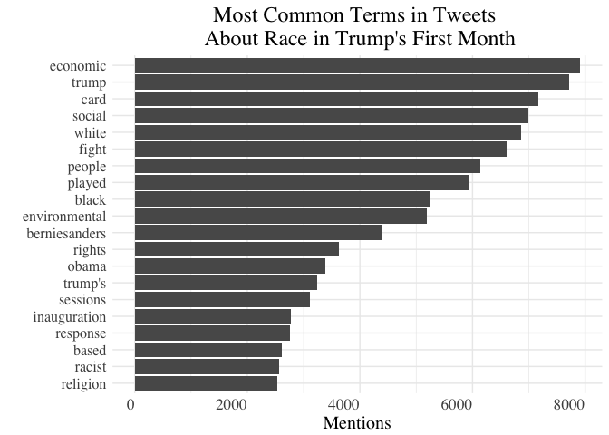
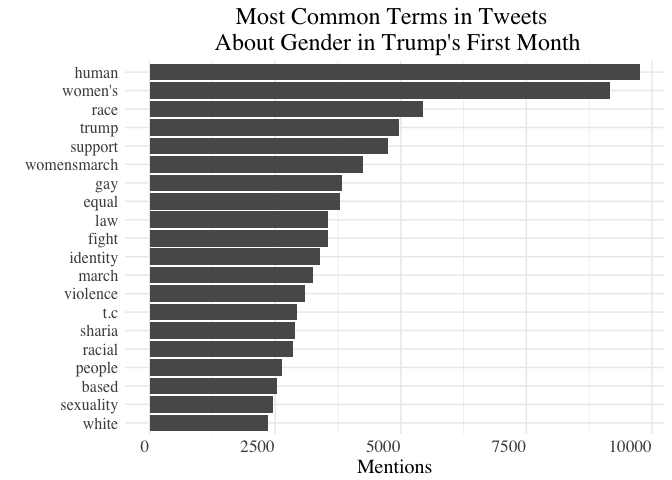
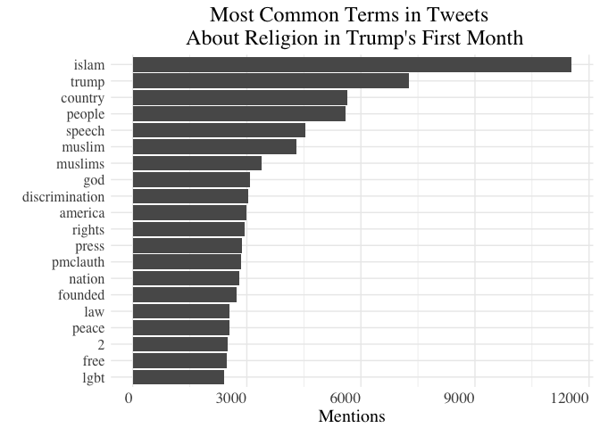
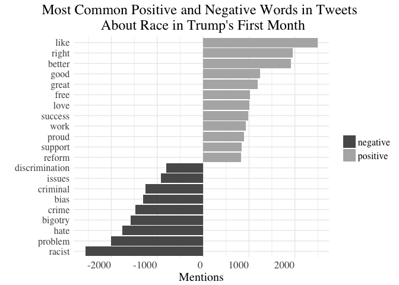
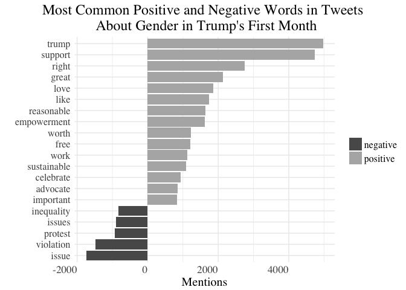
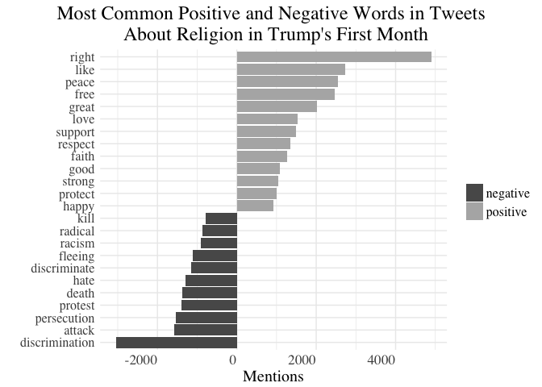
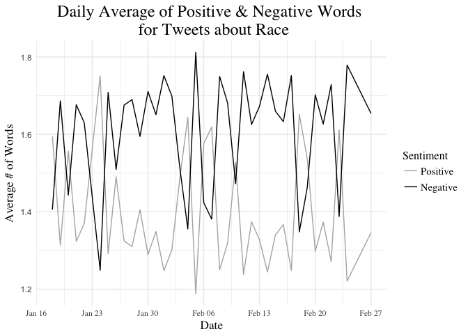
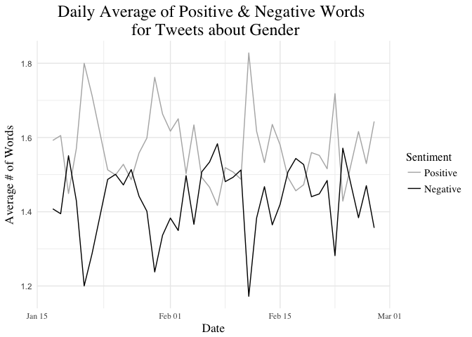
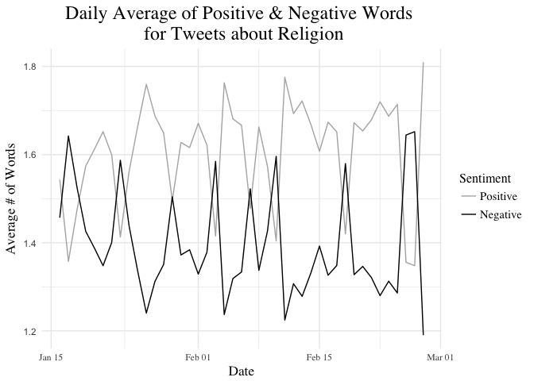

Sentiment Analysis of Tweets about Social Issues
================
Dana Westley
Due Sunday June 4, 2017

Most Common Terms in Tweets About:
==================================

Race
----

Gender
------

Religion
--------

Sentiment Analysis for Positive and Negative Words in Tweets About:
===================================================================

Race
----

Gender
------

Religion
--------

Sentiment of Race Tweets Over Time
==================================

