Sentiment Analysis of Tweets about Social Issues
================
Dana Westley
Due Sunday June 4, 2017

Most Common Terms in Tweets About:
==================================

Race
----

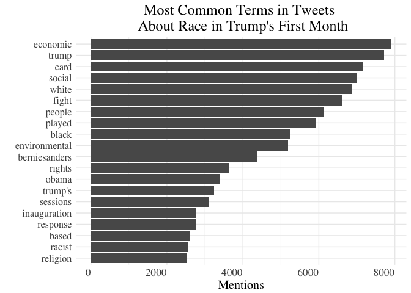

Gender
------

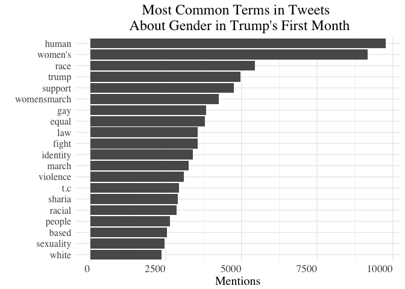

Religion
--------

Sentiment Analysis for Positive and Negative Words in Tweets About:
===================================================================

Race
----

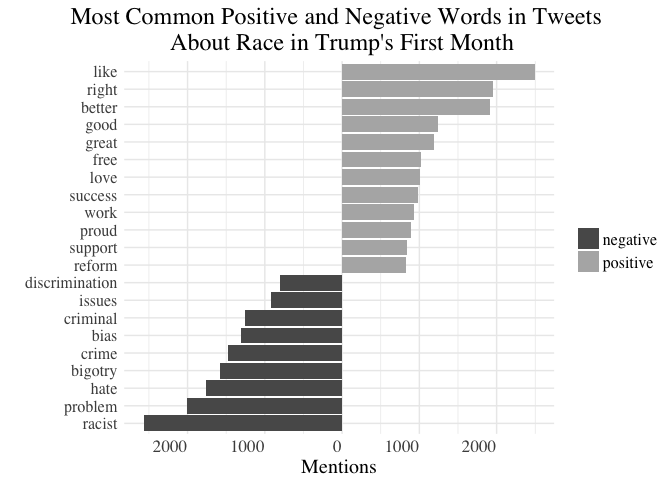

Gender
------

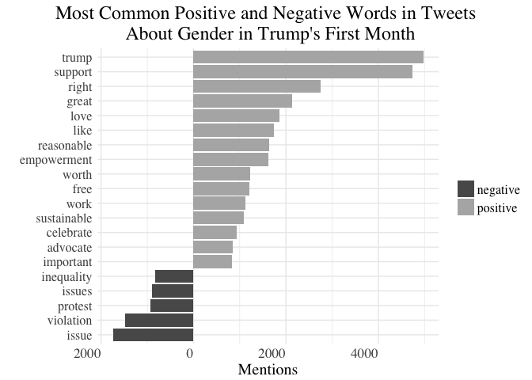

Religion
--------

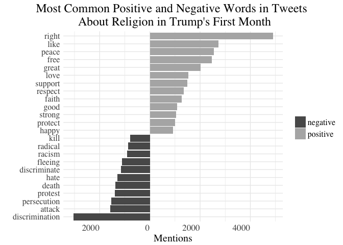

Sentiment of Race Tweets Over Time
==================================

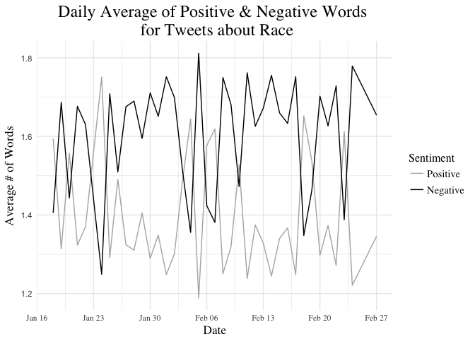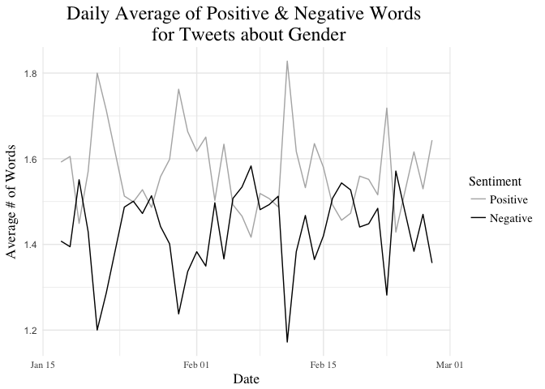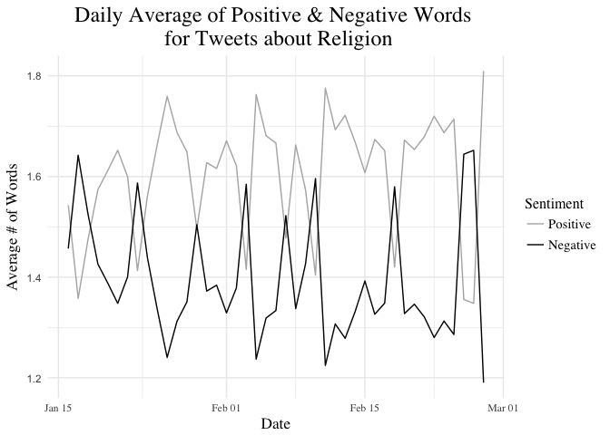

Using Sums instead of Means
===========================

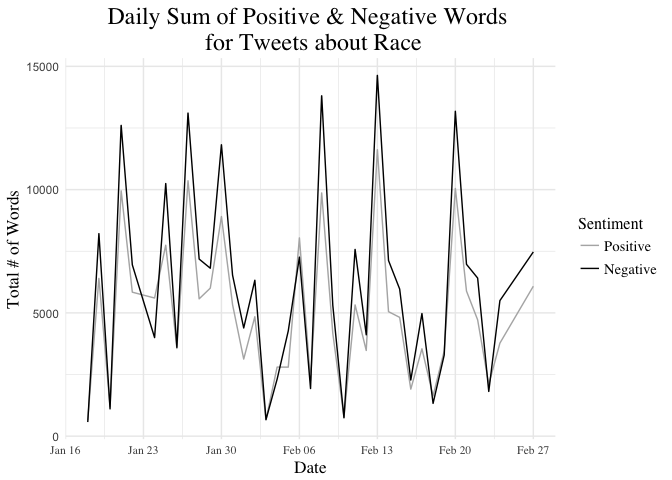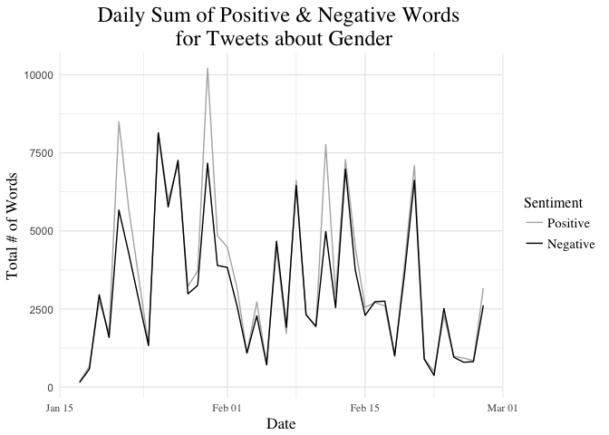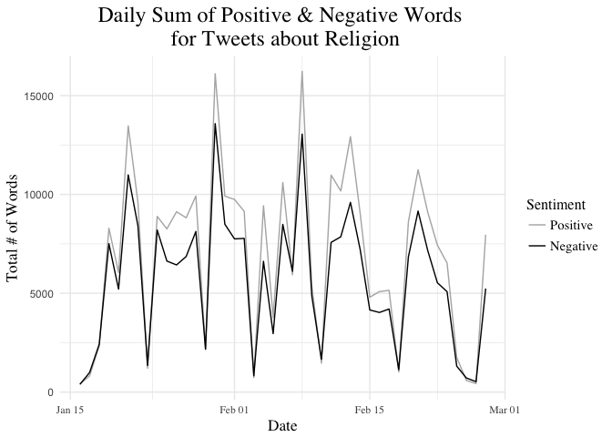

Net Positivity
==============

    ## `geom_smooth()` using method = 'loess' and formula 'y ~ x'

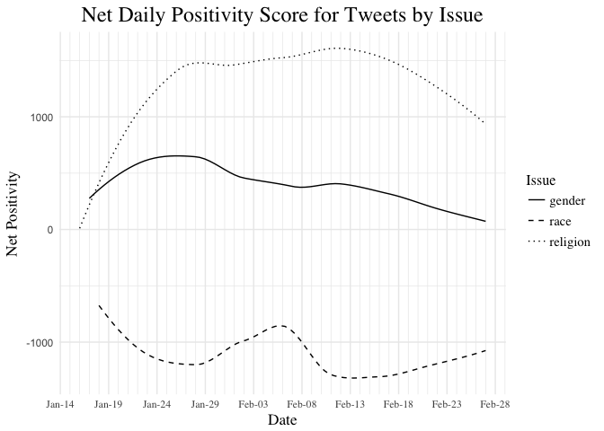
